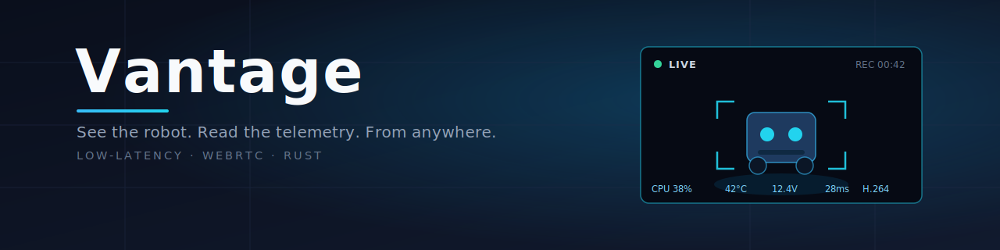

<p align="center">
  
</p>

# Vantage

Low-latency WebRTC system that lets an operator see a robot's live onboard camera
and system telemetry from anywhere (same LAN or remote), with a fleet-wide view of
how many robots are streaming and how many operators are connected. Single-language
Rust stack so message types are shared end to end with no drift.

See `openspec/` for the full specification and `docs/superpowers/plans/` for the
implementation plan.

## Workspace layout

| Crate                | Kind | Responsibility |
|----------------------|------|----------------|
| `vantage-protocol`   | lib  | Shared `serde` types: signalling messages, telemetry (`DeviceInfo`), ICE config, and a one-place codec wrapper (JSON now, `bincode` later). |
| `vantage-signalling` | lib  | Drives a `webrtcbin` peer and the coordinator WebSocket client; shared by robot and client. |
| `vantage-observability` | lib | Shared logging + OpenTelemetry (logs/metrics/traces) init; OTLP export when configured, stderr otherwise. |
| `vantage-coordinator`| bin  | Rendezvous service (axum): robot registration + heartbeat, client discovery, SDP/ICE relay, fleet stats, ICE-server provisioning. |
| `vantage-robot`      | bin  | GStreamer pipeline, telemetry producer; streams to clients over WebRTC. |
| `vantage-client`     | bin  | Operator console: discovers robots, connects, shows live stream + telemetry. |

## Prerequisites

### Rust

Rust 1.90+ (`rustup` recommended).

### System dependencies — GStreamer

`vantage-signalling`, `vantage-robot`, and `vantage-client` link against system
GStreamer via `pkg-config`. The `-dev` packages provide the `gstreamer-1.0`,
`gstreamer-webrtc-1.0`, and `gstreamer-sdp-1.0` pkg-config files the Rust crates
build against; `webrtcbin` lives in plugins-bad and ICE needs the `nice` plugin.

**Debian / Ubuntu:**

```bash
sudo apt-get install -y \
  libgstreamer1.0-dev \
  libgstreamer-plugins-base1.0-dev \
  libgstreamer-plugins-bad1.0-dev \
  gstreamer1.0-plugins-bad \
  gstreamer1.0-plugins-good \
  gstreamer1.0-nice \
  libnice-dev
```

> `vantage-protocol` and `vantage-coordinator` have **no** GStreamer dependency and
> build/test without these packages. Only the media crates require them.

Verify the install:

```bash
pkg-config --modversion gstreamer-webrtc-1.0   # should print a version (e.g. 1.28.2)
gst-inspect-1.0 webrtcbin                       # should print element details
```

### Runtime: STUN / TURN

The coordinator hands ICE servers to peers. A public STUN server is used by
default. For the relay path (when no direct connection is possible) a TURN server
is required — for the PoC, the metered.ca free tier or a self-hosted `coturn`, both
with static credentials. The coordinator reads `VANTAGE_TURN_URL`,
`VANTAGE_TURN_USER`, and `VANTAGE_TURN_PASS` (see the table below) and serves them
over `/ice`.

See **[docs/turn-setup.md](docs/turn-setup.md)** for full metered.ca and coturn-on-a-VPS
setup, and the foundation plan for the forced-relay test.

## Build & test

```bash
# Protocol + coordinator only (no GStreamer needed):
cargo test -p vantage-protocol -p vantage-coordinator

# Everything (requires the GStreamer packages above):
cargo build --workspace
cargo test --workspace
```

## Run

```bash
# 1. Coordinator
RUST_LOG=info cargo run -p vantage-coordinator           # binds 0.0.0.0:8080

# 2. Robot (registers and waits for a client)
RUST_LOG=info VANTAGE_COORDINATOR=ws://localhost:8080 cargo run -p vantage-robot

# 3. Client (discovers, connects, shows telemetry)
RUST_LOG=info VANTAGE_COORDINATOR=ws://localhost:8080 cargo run -p vantage-client
```

### Coordinator environment variables

| Variable            | Default          | Purpose |
|---------------------|------------------|---------|
| `VANTAGE_BIND`      | `0.0.0.0:8080`   | Listen address. |
| `VANTAGE_TURN_URL`  | _(unset)_        | TURN server URL; when set, added to the ICE config handed to peers. |
| `VANTAGE_TURN_USER` | _(unset)_        | TURN username (static credential for the PoC). |
| `VANTAGE_TURN_PASS` | _(unset)_        | TURN credential. |

## Observability (OpenTelemetry → Grafana)

All three binaries emit structured **logs**, **metrics**, and **traces** through
`vantage-observability`. Export is opt-in: set `OTEL_EXPORTER_OTLP_ENDPOINT` to an
OTLP/gRPC collector and the process ships all three signals there; leave it unset
and behaviour is unchanged (plain `RUST_LOG` logging on stderr, no exporter).

```bash
# Export to a local collector / Grafana Alloy on the default OTLP gRPC port.
OTEL_EXPORTER_OTLP_ENDPOINT=http://localhost:4317 \
RUST_LOG=info VANTAGE_COORDINATOR=ws://localhost:8080 cargo run -p vantage-robot
```

Point `OTEL_EXPORTER_OTLP_ENDPOINT` at Grafana Alloy, the OpenTelemetry Collector,
or a Grafana Cloud OTLP endpoint — from there traces land in Tempo, logs in Loki,
and metrics in Prometheus/Mimir. Standard OTLP variables apply:

| Variable                      | Purpose |
|-------------------------------|---------|
| `OTEL_EXPORTER_OTLP_ENDPOINT` | OTLP/gRPC endpoint; **presence enables export** (e.g. `http://localhost:4317`). |
| `OTEL_EXPORTER_OTLP_HEADERS`  | Extra headers, e.g. Grafana Cloud `Authorization=Basic%20<base64>`. |
| `OTEL_SERVICE_NAME`           | Override the `service.name` (defaults to `vantage-<binary>`). |

Emitted metrics: `vantage.robot.{cpu_percent,mem_used_mb,mem_total_mb,uptime_s,temperature_celsius,frames_published}`,
`vantage.coordinator.{robots_online,sessions_active}`,
`vantage.client.{frames_received,telemetry_received}`.

For a ready-to-run Grafana Cloud setup — an OpenTelemetry Collector config and an
importable dashboard — see **[docs/observability/](docs/observability/)**.
